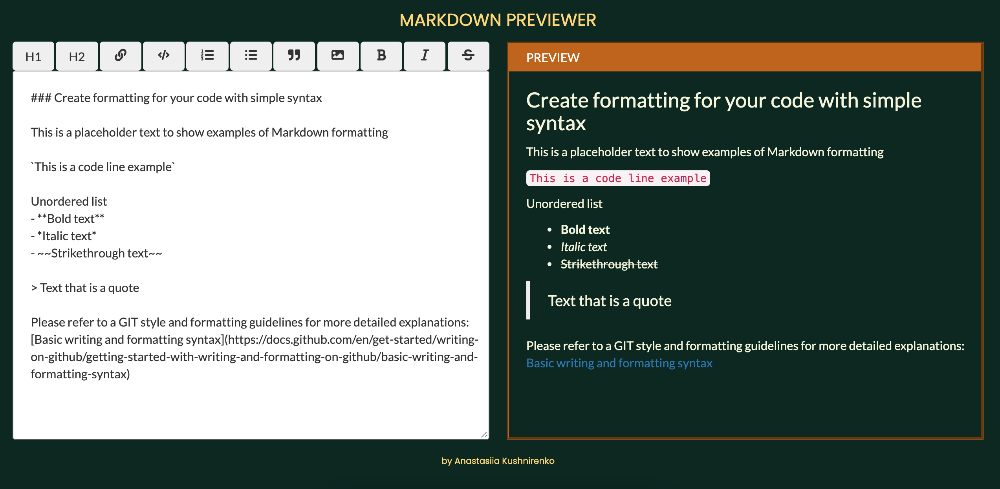
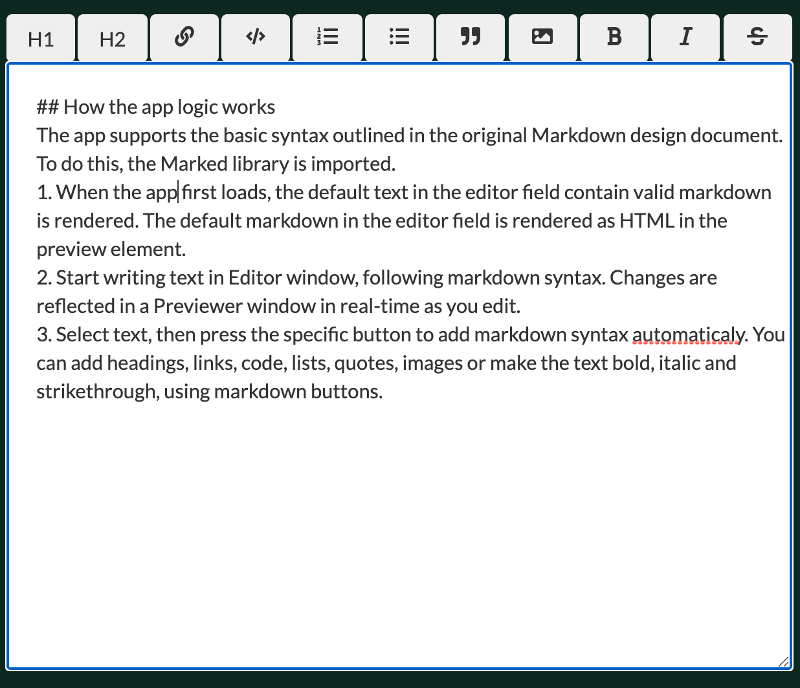
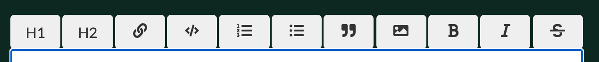

## Project Name & Pitch
Markdown previewer.
The online markdown editor with a live preview.

## Project Screen Shot

## Installation and Setup Instructions
Clone down this repository. You will need node and npm installed globally on your machine.

Installation:  
`npm install`

To Run Test Suite:  
`npm test`

To Start Server:  
`npm start`

To Visit App:  
`localhost:3000`

## Reflection
The project was created to put my front-end development skills to test what I've learned up to this point. I used a mix of HTML, JavaScript, JSX, CSS, Bootstrap, and React to complete it. 

The aim was to built an application that allowed users to easily edit their markdown document and preview it as they edit.

I chose the `create-react-app` boilerplate to minimize the initial setup and invest more time in diving into writing the code. 

Working on this project, I learned how to build out a user interface with stateful components and create stateful context providers to store state data in a single location. I used Hooks to define rules about why and when rendering should happen – useState, useContext enhanced rendering performance, reflecting the latest data.

## How the app logic works
The app supports the basic syntax outlined in the original Markdown design document. To do this, the Marked library is imported. 
- When the app first loads, the default text in the editor field containing a valid markdown is rendered. The default markdown in the editor field is rendered as HTML in the preview element.
- Start writing text in the Editor field, following markdown syntax. Changes are reflected in a Previewer field in real-time as you edit.

**Editor**  

**Previewer**  

- Select text, then press the specific button to add markdown syntax automatically. You can add headings, links, code, lists, quotes, and images or make the text bold, italic and strikethrough, using markdown buttons.

**Buttons**  

## Acknowledgments

[React Icons](https://react-icons.github.io/react-icons/ )  
[Bootstrap](https://getbootstrap.com/docs/4.0/getting-started/webpack/ )  
[Marked React](https://www.npmjs.com/package/marked-react )
